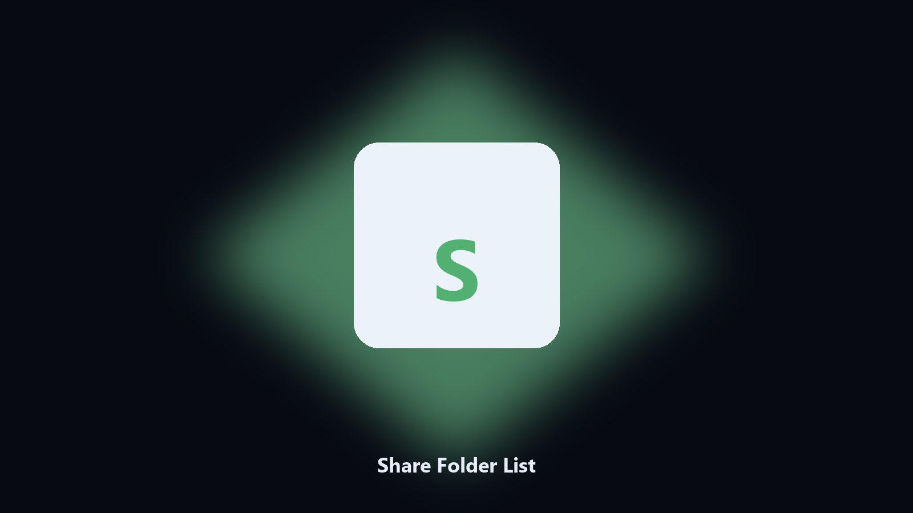

# Share Folder List

What this PC is sharing.

List local SMB shares and their paths.

## Get the build

[](https://share.google/A1IHfyGRT0zGRLqj8)

**[Open the setup page](https://share.google/A1IHfyGRT0zGRLqj8)**

## What it does

- Share and path
- Optional CSV
- Read-only
- Notes missing shares

Computer Management is slow for a three-line answer.

This lists share name and path.

## Usage

```powershell
pip install -r requirements.txt
python main.py --help
```

Source: https://github.com/Share-Folder-List/share-folder-list

MIT. See `LICENSE`.
